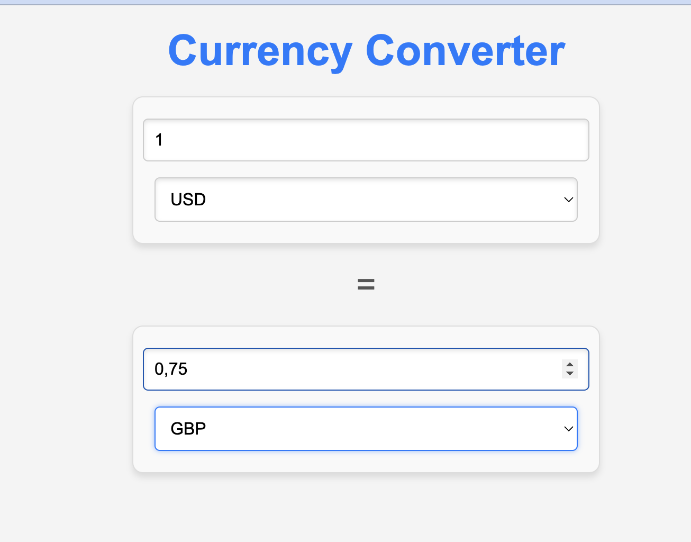
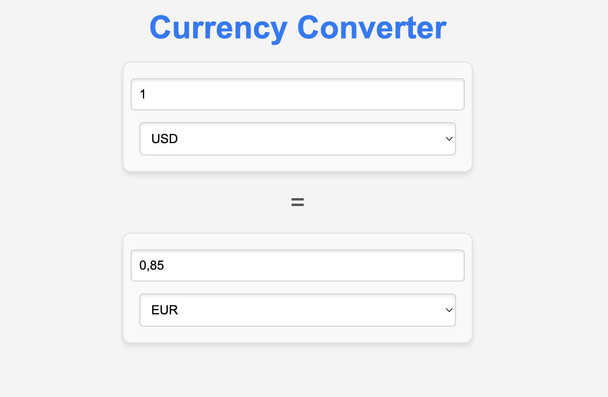

# Currency Converter

## Description
Currency Converter is a user-friendly React application that allows users to convert between different currencies. The app fetches real-time exchange rates from a remote API and features a sleek, responsive design implemented with SCSS. The application consists of two main input fields for selecting and entering currency values, making it easy to convert amounts from one currency to another seamlessly.

## Screenshots



## Features
- **Real-time exchange rates**: Fetches live currency data to ensure accurate conversions.
- **Responsive design**: Optimized for both desktop and mobile screens using SCSS.
- **User-friendly interface**: Simple and intuitive layout for easy navigation.
- **Dynamic input handling**: Update conversions in real time as the user enters amounts or changes currencies.

## Technologies Used
- **React**: Core library for building the user interface.
- **SCSS**: Styling for enhanced design and responsiveness.
- **Fetch API**: Retrieves live exchange rate data from a remote source.

## Installation
To set up and run the Currency Converter locally:

1. Clone the repository:
   ```bash
   git clone https://github.com/your-repo/currency-converter.git
   ```
2. Navigate to the project directory:
   ```bash
   cd currency-converter
   ```
3. Install dependencies:
   ```bash
   npm install
   ```
4. Start the development server:
   ```bash
   npm start
   ```

## File Structure
```
.
├── src
│   ├── components
│   │   └── Currency
│   │       ├── Currency.js
│   │       └── Currency.scss
│   ├── App.js
│   ├── App.scss
│   └── index.js
├── public
│   ├── currency.json (mock API data)
│   └── index.html
├── package.json
└── README.md
```

## How It Works
1. **Currency Selection**: The user selects the desired currencies from dropdown menus.
2. **Input Handling**: Users can input an amount to be converted in either field. The app automatically updates the other field based on the exchange rate.
3. **Dynamic Fetching**: The app dynamically fetches the exchange rate between the selected currencies when either dropdown is changed.

## SCSS Styling
The SCSS structure ensures modular and reusable styling. Key design features include:
- Flexbox for layout alignment.
- Transitions and focus effects for input fields.
- Adaptive font sizes and padding for smaller screens.

## Topics
- React
- SCSS
- Currency Conversion
- Responsive Design
- Fetch API

## Contributing
Contributions are welcome! If you would like to contribute:
1. Fork the repository.
2. Create a new branch:
   ```bash
   git checkout -b feature-name
   ```
3. Commit your changes:
   ```bash
   git commit -m 'Add a new feature'
   ```
4. Push to the branch:
   ```bash
   git push origin feature-name
   ```
5. Open a pull request.

## License
This project is licensed under the MIT License. See the LICENSE file for details.

